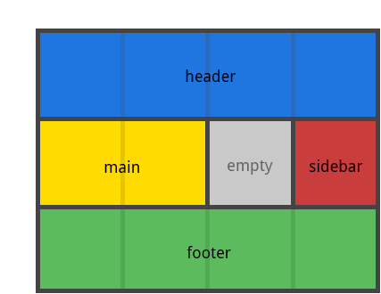
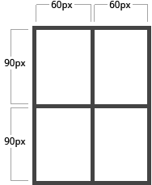
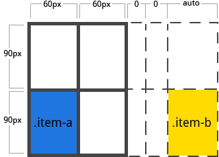
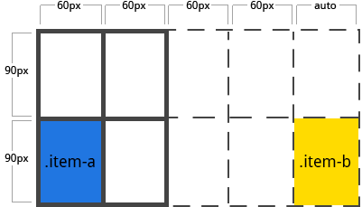

###### CSS Layout

# CSS Grid 레이아웃 모듈 레벨 1

## 목차

<details>
  <summary>펼쳐보기</summary>

  <br>

  - [1. CSS 레이아웃 역사](#1-css-레이아웃-역사)
  - [2. CSS Grid 모듈](#2-css-grid-모듈)
    - [2-1. W3C, CSS Grid Layout Module Level 1](#2-1-w3c-css-grid-layout-module-level-1)
    - [2-2. W3C 프로세스 (Process) 상태](#2-2-w3c-프로세스-process-상태)
    - [2-3. Browser 지원 범위](#2-3-browser-지원-범위)
    - [2-4. 대체 수단 (Polyfill)](#2-4-대체-수단-polyfill)
  - [3. CSS Grid 용어](#3-css-grid-용어)
    - [3-1. Grid container](#3-1-grid-container)
    - [3-2. Grid Items](#3-2-grid-items)
    - [3-3. Grid Line](#3-3-grid-line)
    - [3-4. Grid Cell](#3-4-grid-cell)
    - [3-5. Grid Track](#3-5-grid-track)
    - [3-6. Grid Area](#3-6-grid-area)
  - [4. CSS Grid 사용법](#4-css-grid-사용법)
    - [4-1. 그리드 설정](#4-1-그리드-설정)
    - [4-2. 그리드 행/열 템플릿 설정](#4-2-그리드-행열-템플릿-설정)
    - [4-3. 그리드 템플릿 영역 설정](#4-3-그리드-템플릿-영역-설정)
    - [4-4. 그리드 템플릿 설정](#4-4-그리드-템플릿-설정)
    - [4-5. 그리드 거터 설정](#4-5-그리드-거터-설정)
    - [4-6. 행축(row axis) 기준, 아이템 콘텐츠 정렬](#4-6-행축row-axis-기준-아이템-콘텐츠-정렬)
    - [4-7. 열축(column axis) 기준, 아이템 콘텐츠 정렬](#4-7-열축column-axis-기준-아이템-콘텐츠-정렬)
    - [4-8. 행축(row axis), 그리드 아이템 트랙 정렬](#4-8-행축row-axis-그리드-아이템-트랙-정렬)
    - [4-9. 열축(column axis), 그리드 아이템 트랙 정렬](#4-9-열축column-axis-그리드-아이템-트랙-정렬)
    - [4-10. 그리드 행/열 자동 설정](#4-10-그리드-행열-자동-설정)
    - [4-11. 그리드 자동 플로우 설정](#4-11-그리드-자동-플로우-설정)
    - [4-12. 그리드 단축 속성 설정](#4-12-그리드-단축-속성-설정)
    - [4-13. 그리드 아이템 행/열 시작/끝 배치 설정](#4-13-그리드-아이템-행열-시작끝-배치-설정)
    - [4-14. 그리드 아이템 행/열 배치 속기형 설정](#4-14-그리드-아이템-행열-배치-속기형-설정)
    - [4-15. 그리드 아이템 영역 배치 설정](#4-15-그리드-아이템-영역-배치-설정)
    - [4-16. 행 축(row axis) 기준, 아이템 콘텐츠 정렬](#4-16-행-축row-axis-기준-아이템-콘텐츠-정렬)
    - [4-17. 열 축(column axis) 기준, 아이템 콘텐츠 정렬](#4-17-열-축column-axis-기준-아이템-콘텐츠-정렬)
  - [5. CSS Grid 속성 정리](#5-css-grid-속성-정리)
  - [참고](#참고)
</details>

## 1. CSS 레이아웃 역사

1. 레이아웃이 없던 시절
1. Table 레이아웃
1. Frame 레이아웃
1. Floating, Positioning 레이아웃
1. Flexbox 레이아웃
1. __Grid 레이아웃__

## 2. CSS Grid 모듈

### 2-1. [W3C, CSS Grid Layout Module Level 1](https://www.w3.org/TR/css-grid-1/)

### 2-2. [W3C 프로세스 (Process)](https://goo.gl/wSDU4Y) 상태
  - [ ] WD (초안)
  - [x] CR (입후보) - 표준 입후보 (Candidate Recommendation)
  - [ ] PR (제안)
  - [ ] REC (표준)

### 2-3. Browser 지원 범위

    2017.11.16 현재 상황

[<br>](https://goo.gl/30osRG)


### 2-4. 대체 수단 ([Polyfill](https://github.com/codler/Grid-Layout-Polyfill))

<br>

[⬆︎ 목차로 이동](#목차)

## 3. CSS Grid 용어

용어 | 설명 | 비고
--- | --- | ---
Grid | 그리드 컨테이너 요소 | 포함된 자식요소 그리드 아이템으로 설정
Grid Line | 그리드를 구성하는 수직/수평 선 |
Grid Track | 그리드 라인(수직/수평선)으로 행 또는 열 |
Grid Cell | 4개의 그리드 라인(사각형)으로 구성된 유닛 |
Grid Area | 4개의 그리드 라인(사각형) 영역 |
Grid Gutters | 컬럼/로우 사이 간격 |

### 3-1. Grid container

`display` 속성 값이 `grid`로 설정된 요소를 말하며 그리드 컨테이너 역할을 수행하게 됩니다.

```html
<div class="grid-container"></div>
```

### 3-2. Grid Items

그리드 컨테이너 내부에 포함한 자식요소는 그리드 아이템으로 설정됩니다.

```html
<div class="grid-container">
  <div class="grid-item">그리드 아이템</div>
  <div class="grid-item">그리드 아이템</div>
  <div class="grid-item">그리드 아이템</div>
</div>
```

### 3-3. Grid Line

그리드 구조를 구성하는 수직/수평 <strong>선</strong>을 말합니다. 행(수평), 열(수직) 방향으로 구분됩니다.<br>
노란색 선은 수직 선으로 <strong>열 그리드라인(Column Grid Line) 3</strong> 입니다.


### 3-4. Grid Cell

그리드를 구성하는 싱글 유닛(Unit)으로 각각 2개의 인접한 행, 열 그리드라인으로 이루어집니다.<br>
노란색 유닛은 <strong>행 그리드라인 1, 2와 열 그리드라인 2, 3으로 구성된 셀</strong> 입니다.


### 3-5. Grid Track

인접한 그리드라인 사이 간격을 말하며, 행(row) 또는 열(column)처럼 생각하면 됩니다.<br>
노란색 영역은 <strong>행 그리드라인(Row Grid Line) 2 에서 3 사이 그리드트랙</strong> 입니다.


### 3-6. Grid Area

4개의 그리드라인으로 구성된 총 영역(Total Area)을 말합니다. 그리드 영역은 임의의 그리드 셀로 구성됩니다.<br>
노란색 영역은 <strong>행 그리드라인 1에서 3, 열 그리드라인 1에서 3 사이 영역으로 4개의 그리드 셀을 포함</strong> 합니다.


<br>
<br>
<br>

[⬆︎ 목차로 이동](#목차)

## 4. CSS Grid 사용법

### 4-1. 그리드 설정

그리드 컨테이너 요소를 설정하고 그리드 포멧팅 컨텍스트(Grid Formatting Context) 영역을 생성합니다.

속성 | 값 | 비고
--- | --- | ---
display | grid |
| | inline-grid |
| | <s>subgrid</s> | [Level 2에서 지원 예정.](https://www.w3.org/TR/css-grid-1/#changes)

```css
.grid-container {
  display: grid; /* grid | inline-grid */
}
```

※ `float`, `clear`, `column`, `vertical-align` 속성은 그리드 컨테이너 요소에 적용되지 않습니다.

<br>

[⬆︎ 목차로 이동](#목차)

### 4-2. 그리드 행/열 템플릿 설정

공백으로 구분된 값 리스트를 해석하여 그리드 행(Row), 열(Column)을 설정합니다. 각 값은 트랙 크기를 말합니다.

속성 | 값 | 비고
--- | --- | ---
grid-template-rows | \<track-size\> ... |
| | \<line-name\> \<track-size\> ... |
grid-template-columns | \<track-size\> ... |
| | \<line-name\> \<track-size\> ... |

__값__

- \<track-size\>: 그리드에서 사용 가능한 공간의 길이 (`px`, `rem`, `em`, `%`, `fr` 등)
- \<line-name\>: 사용자가 설정한 임의의 선 이름

__예시__

그리드 컨테이너 요소에 행/열 템플릿을 설정합니다.

```css
.grid-container {
  grid-template-rows: 25% 100px auto;
  grid-template-columns: 40px 50px auto 50px 40px;
}
```

<br>

브라우저에 그려지는 결과는 다음과 같습니다.


<br>
<br>
<br>

사용자가 임의로 설정한 선 이름(`[이름]`)을 사용할 수도 있습니다.

```css
.grid-container {
  grid-template-rows: [row-1-start] 25% [row-1-end] 100px [third-line] auto [last-line];
  grid-template-columns: [first] 40px [line2] 50px [line3] auto [col4-start] 50px [five] 40px [end];
}
```

<br>


<br>
<br>

선 이름을 1개 이상 설정하는 것도 가능합니다.<br>
방법은 `[이름-1 이름-2]`와 같이 `[]` 내부에 공백으로 구분된 이름을 추가하면 됩니다.

```css
.grid-container {
  grid-template-rows: [row-1] 100px [rows-1-end row-2-start] 30% [row-2-end];
}
```

설정이 반복되는 경우, `repeat()` 함수를 사용하여 손쉽게 설정할 수 있습니다.

```css
.grid-container {
  grid-template-rows: repeat(3, 80px [row-start]) 5%;
  /* 결과: 80px [row-start] 80px [row-start] 80px [row-start] 5% */
  grid-template-columns: repeat(2, 15% 30px) auto;
  /* 결과: 15% 30px 15% 30px auto */
}
```

`fr` 단위를 사용하여 \<track-size\>를 그리드의 남은 공간 일부를 설정할 수 있습니다.<br>
다음은 열 그리드를 3분할 한 예시입니다.

```css
.grid-container {
  grid-template-columns: repeat(3, 1fr); /* 1fr 1fr 1fr */
}
```

`fr` 단위는 고정 값(`px`, `rem` 등) 단위가 먼저 계산된 후, 남은 공간을 사용하여 계산 처리됩니다.<br>
다음 예시에서는 그리드 컨테이너 높이 값에서 `100px`을 뺀 다음, 남은 공간을 2분할 합니다.

```css
.grid-container {
  grid-template-rows: 1fr 100px 1fr;
}
```

<br>

[⬆︎ 목차로 이동](#목차)

### 4-3. 그리드 템플릿 영역 설정

`grid-area` 속성으로 설정된 그리드 영역의 이름을 참조하여, 그리드 템플릿 영역을 설정할 수 있습니다. 그리드 영역 이름을 반복하면 그리드 셀을 병합(merge, `span`) 합니다. 그리고 마침표(`.`)는 비어있는 그리드 셀을 말합니다.

속성 | 값 | 비고
--- | --- | ---
grid-template-areas | \<grid-area-name\> |
| | . |
| | none |

__값__

- \<grid-area-name\>: 사용자가 `grid-area` 속성 값으로 설정한 임의의 그리드 영역 이름
- 마침표(`.`): 비어있는 그리드 셀
- none: 그리드 영역으로 정의되지 않은 셀

__예시__

다음은 3행 4열 그리드 템플릿 영역 설정 예시입니다.

```css
/* 그리드 영역 이름 설정 */
.grid-header  { grid-area: 'header';  }
.grid-main    { grid-area: 'main';    }
.grid-sidebar { grid-area: 'sidebar'; }
.grid-footer  { grid-area: 'footer';  }


.grid-container {
  grid-template-rows: repeat(3, 300px);
  grid-template-columns: repeat(4, 1fr);

  /**
   * 그리드 템플릿 영역 설정
   * 각 행은 동일한 개수의 열 설정이 요구됩니다.
   */
  grid-template-areas:
    "header header header header"  /* 1행: 4열 모두 header                */
    "main main . sidebar"          /* 2행: 2열 main 1열, 공백 1열, sidebar */
    "footer footer footer footer"; /* 3행: 4열 모두 header                */

}
```

결과는 다음과 같이 그려집니다.



<br>
<br>

그리드 템플릿 영역 설정은 그리드라인 설정이 아니라, 영역을 설정하는 것입니다. 영역을 설정하면 그리드라인 이름이 자동으로 설정됩니다. `grid-area`로 설정된 이름을 사용하여 각 행/열의 시작은 `-start`, 끝은 `-end`로 이름이 설정됩니다. 예를 들면 다음과 같습니다.

```css
[header-start]                               [header-end]
[main-start] . [main-end ] . [sidebar-start] [sidebar-end]
[footer-start]                               [footer-end]
```

<br>

[⬆︎ 목차로 이동](#목차)

### 4-4. 그리드 템플릿 설정

그리트 템플릿 행/열/영역이름 설정을 속기형으로 설정 가능합니다.

속성 | 값 | 비고
--- | --- | ---
grid-template | grid-template-rows / grid-tempate-columns |

__값__

- none: 3가지 설정을 모두 초기 값으로 적용
- grid-template-rows / grid-template-columns: 행/열 그리드 템플릿 설정

__예시__

다음 예시는 그리드 행/열 템플릿을 속기형 속성으로 설정한 예입니다.

```css
.grid-container {
  grid-template: repeat(3, 100px) / repeat(2, 20px 40px) auto;
}
```

그리고 다소 복잡해보이지만, 행/열 그리드 템플릿에 영역이름 템플릿을 함께 설정 할 수 있습니다.

```css
.grid-container {
  grid-template:
    [row-1-start] "header header header" 100px [row-1-end]
    [row-2-start] "footer footer footer" 100px [row-2-end]
    / auto 200px auto;
}
```

속기형으로 적용된 속성을 개별 속성으로 풀어보면 다음과 같습니다.

```css
.grid-container {
  grid-template-rows: [row-1-start] 100px [row-1-end row-2-start] 100px [row-2-end];
  grid-template-columns: auto 200px auto;
  grid-template-areas:
    "header header header"
    "footer footer footer";
}
```

※ grid-template-areas 속성은 암시적인 그리드 속성을 초기화하지 않습니다.

- [grid-auto-rows](#4-10-그리드-행열-자동-설정)
- [grid-auto-columns](#4-10-그리드-행열-자동-설정)
- [grid-auto-flow](#4-11-그리드-자동-플로우-설정)

※ grid-template-areas 속성 대신 [grid](#4-12-그리드-단축-속성-설정) 속성 사용을 권장합니다.

<br>

[⬆︎ 목차로 이동](#목차)

### 4-5. 그리드 거터 설정

그리드라인 사이 간격을 설정합니다. 행/열 컬럼 사이 간격을 설정한다고 이해하세요.

속성 | 값 | 비고
--- | --- | ---
grid-row-gap | \<line-size\> |
grid-column-gap | \<line-size\> |
grid-gap | \<grid-row-gap\> \<grid-column-gap\> | 속기형 속성 설정

__예시__

다음 예시는 그리드 행/열 거터(사이 간격)를 설정한 예입니다.

```css
.grid-container {
  grid-template-rows: 80px auto 80px;
  grid-template-columns: 100px 50px 100px;
  /* 행 거터(사이 간격) 설정 */
  grid-row-gap: 10px;
  /* 열 거터(사이 간격) 설정 */
  grid-column-gap: 15px;
}
```

<br>

결과를 그려보면 다음과 같습니다.


<br>
<br>

※ 거터(gutters)는 행/열 사이 간격에만 설정되며, 그리드 마진(margin)을 설정하지 않습니다.

<br>

위 예제에서 다룬 속성을 속기형으로 작성하면 다음과 같습니다.

```css
.grid-container {
  grid-template: 80px auto 80px / 100px 50px 100px;
  grid-gap: 10px 15px;
}
```

※ `grid-gap` 값으로 1개만 입력하면 행/열 간격이 동일하게 설정됩니다.

<br>

[⬆︎ 목차로 이동](#목차)

### 4-6. 행축(row axis) 기준, 아이템 콘텐츠 정렬

행(row) 축을 따라 그리드 아이템 내부 콘텐츠를 정렬합니다. (`align-items` 속성의 반대)<br>
이 설정은 그리드 컨테이너 내부 모든 그리드 아이템에 적용됩니다.

속성 | 값 | 비고
--- | --- | ---
justify-items | start |
| | center |
| | end |
| | stretch | 기본 값

__값__

- __start__: 그리드 영역의 시작점에 콘텐츠 정렬
- __center__: 그리드 영역의 끝점에 콘텐츠 정렬
- __end__: 그리드 영역의 중앙에 콘텐츠 정렬
- __stretch__: 그리드 영역 전체 너비를 채움 (기본 값)

__예시__

```css
.grid-container {
  justify-items: start;
}
```


<br>
<br>

```css
.grid-container {
  justify-items: center;
}
```


<br>
<br>

```css
.grid-container {
  justify-items: end;
}
```


<br>
<br>

```css
.grid-container {
  justify-items: stretch;
}
```


<br>
<br>

※ 개별 그리드 아이템에 행축 콘텐츠 정렬 속성을 적용하려면 `justify-self` 속성을 사용합니다.

<br>

[⬆︎ 목차로 이동](#목차)

### 4-7. 열축(column axis) 기준, 아이템 콘텐츠 정렬

열(column) 축을 따라 그리드 아이템 내부 콘텐츠를 정렬합니다. (`justify-items` 속성의 반대)<br>
이 설정은 그리드 컨테이너 내부 모든 그리드 아이템에 적용됩니다.

속성 | 값 | 비고
--- | --- | ---
align-items | start |
| | center |
| | end |
| | stretch | 기본 값

__값__

- __start__: 그리드 영역의 시작점에 콘텐츠 정렬
- __center__: 그리드 영역의 끝점에 콘텐츠 정렬
- __end__: 그리드 영역의 중앙에 콘텐츠 정렬
- __stretch__: 그리드 영역 전체 너비를 채움 (기본 값)

__예시__

```css
.grid-container {
  align-items: start;
}
```


<br>
<br>

```css
.grid-container {
  align-items: center;
}
```


<br>
<br>

```css
.grid-container {
  align-items: end;
}
```


<br>
<br>

```css
.grid-container {
  align-items: stretch;
}
```


<br>
<br>

※ 개별 그리드 아이템에 열축 콘텐츠 정렬 속성을 적용하려면 `justify-self` 속성을 사용합니다.

<br>

[⬆︎ 목차로 이동](#목차)

### 4-8. 행축(row axis), 그리드 아이템 트랙 정렬

그리드 컨테이너의 크기보다 작은 그리드 아이템 트랙(`px`과 같은 고정 단위로 설정된 경우)의 크기라면,
아이템 트랙을 정렬할 수 있습니다. 이 속성은 행(row) 축을 따라 그리드 아이템 트랙을 정렬합니다. (`align-content` 속성의 반대)

속성 | 값 | 비고
--- | --- | ---
justify-content | start |
| | center |
| | end |
| | stretch |
| | space-around |
| | space-between |
| | space-evenly |

__값__

- __start__: 그리드 컨테이너 영역의 시작점에 아이템 트랙을 정렬
- __center__: 그리드 컨테이너 영역의 중앙에 아이템 트랙을 정렬
- __end__: 그리드 컨테이너 영역의 끝점에 아이템 트랙을 정렬
- __stretch__: 그리드 컨테이너 영역을 아이템 트랙 크기를 조정하여 채움
- __space-around__: 그리드 컨테이너의 남은 영역을 아이템 트랙(열)이 좌/우 공간으로 나눔<br>(양 가장자리 공간은 아이템 그룹 사이 간격의 1/2)
- __space-between__: 그리드 컨테이너 영역의 양 가장자리 공백 없이, 아이템 트랙(열) 사이 공간을 나눔
- __space-evenly__: `space-around`와 비슷해보이지만, 공간을 모두 동일하게 나누는 점이 다름 (아래 예시 그림 참조)

__예시__

```css
.grid-container {
  justify-content: start;
}
```


<br>
<br>

```css
.grid-container {
  justify-content: center;
}
```


<br>
<br>

```css
.grid-container {
  justify-content: end;
}
```


<br>
<br>

```css
.grid-container {
  justify-content: stretch;
}
```


<br>
<br>

```css
.grid-container {
  justify-content: space-around;
}
```


<br>
<br>

```css
.grid-container {
  justify-content: space-between;
}
```


<br>
<br>

```css
.grid-container {
  justify-content: space-evenly;
}
```


<br>
<br>

<br>

[⬆︎ 목차로 이동](#목차)

### 4-9. 열축(column axis), 그리드 아이템 트랙 정렬

그리드 컨테이너의 크기보다 작은 그리드 아이템 트랙(`px`과 같은 고정 단위로 설정된 경우)의 크기라면, 아이템 트랙을 정렬할 수 있습니다.
이 속성은 열(column) 축을 따라 그리드 아이템 트랙을 정렬합니다. (`justify-content` 속성의 반대)

속성 | 값 | 비고
--- | --- | ---
align-content | start |
| | center |
| | end |
| | stretch |
| | space-around |
| | space-between |
| | space-evenly |

__값__

- __start__: 그리드 컨테이너 영역의 시작점에 아이템 트랙을 정렬
- __center__: 그리드 컨테이너 영역의 중앙에 아이템 트랙을 정렬
- __end__: 그리드 컨테이너 영역의 끝점에 아이템 트랙을 정렬
- __stretch__: 그리드 컨테이너 영역을 아이템 트랙 크기를 조정하여 채움
- __space-around__: 그리드 컨테이너의 남은 영역을 아이템 트랙(행)이 좌/우 공간으로 나눔<br>(양 가장자리 공간은 아이템 그룹 사이 간격의 1/2)
- __space-between__: 그리드 컨테이너 영역의 양 가장자리 공백 없이, 아이템 트랙(행) 사이 공간을 나눔
- __space-evenly__: `space-around`와 비슷해보이지만, 공간을 모두 동일하게 나누는 점이 다름 (아래 예시 그림 참조)


__예시__

```css
.grid-container {
  align-content: start;
}
```


<br>
<br>

```css
.grid-container {
  align-content: center;
}
```


<br>
<br>

```css
.grid-container {
  align-content: end;
}
```


<br>
<br>

```css
.grid-container {
  align-content: stretch;
}
```


<br>
<br>

```css
.grid-container {
  align-content: space-around;
}
```


<br>
<br>

```css
.grid-container {
  align-content: space-between;
}
```


<br>
<br>

```css
.grid-container {
  align-content: space-evenly;
}
```


<br>
<br>

<br>

[⬆︎ 목차로 이동](#목차)

### 4-10. 그리드 행/열 자동 설정

암시적인 그리드 행/열 트랙 크기를 자동으로 설정합니다.

__암시적인 그리드 트랙이란?__

사용자가 설정하지 않은 임의의 트랙으로, 사용자가 명시적으로 `grid-template-rows` / `grid-template-columns` 속성을 설정하지 않은 나머지 그리드 트랙을 가리킵니다.

속성 | 값 | 비고
--- | --- | ---
grid-auto-rows | \<track-size\> ... |
grid-auto-columns | \<track-size\> ...  |

__값__

- __\<track-size\>__: 그리드에서 사용 가능한 단위 (`px`, `rem`, `em`, `%`, `fr` 등)


__예시__

사용자가 명시적으로 행/열 템플릿 속성을 설정하면 그리드 트랙 크기로 적용됩니다.

```css
.grid-container {
  grid-template-rows: repeat(2, 60px);
  grid-template-columns: 90px 90px;
}
```

결과는 2행 2열 그리드가 만들어집니다.


<br>
<br>

여기서 만약 개별 그리드 아이템에 행/열 위치를 그리드라인 기준으로 배치(레이아웃)하게 되면 어떻게 될까요?

- [grid-row](#4-14-그리드-아이템-행열-배치-속기형-설정)
- [grid-column](#4-14-그리드-아이템-행열-배치-속기형-설정)

```css
.item-a {
  grid-row: 2 / 3;
  grid-column: 1 / 2;
}

.item-b {
  grid-row: 2 / 3;
  grid-column: 5 / 6;
}
```

<br>

결과는 다음과 같이 처리됩니다.


<br>
<br>

결과에서 보여지듯이 .item-b에 설정한 열 그리드라인 5~6 배치는 암시적인 열 그리드(grid-auto-columns) 설정에서 정의되지 않은 영역으로, 존재하지 않는 행/열에 배치하기 위해 암시적인 트랙이 자동으로 생성됩니다.
(그림을 자세히 보면 암시적으로 생성된 트랙 크기는 0으로 설정됩니다)

이처럼 자동으로 생성되는 그리드 트랙 크기를 임의의 값으로 설정하고 싶다면 다음과 같이 설정할 수 있습니다.

```css
.grid-container {
  grid-auto-columns: 60px;
}
```

<br>

결과를 그려보면 다음과 같습니다. 암시적으로 생성된 그리드 트랙 크기는 60px로 설정됩니다.


<br>
<br>
<br>

[⬆︎ 목차로 이동](#목차)

### 4-11. 그리드 자동 플로우 설정

그리드에 명시적으로 배치(레이아웃) 되지 않은 아이템이 있을 경우, 자동 배치 알고리즘이 실행되어 자동으로 배치되도록 설정할 수 있습니다. 속성 값에 따라 자동 배치 알고리즘 작동 방식이 달라집니다.

속성 | 값 | 비고
--- | --- | ---
grid-auto-flow | row | 기본 값
| | column |
| | dense |

__값__

값 | 설명
--- | ---
row | 각 행을 차례로 채우고 필요에 따라 새 행을 추가하는 자동 배치 알고리즘
column | 각 열을 차례로 채우고 필요에 따라 새 열을 추가하는 자동 배치 알고리즘
dense | 배치 중 나중에 크기가 작은 아이템이 존재할 경우, 그리드 영역 앞부분의 남은 공간에 자동 배치하는 알고리즘

__예시__

HTML 마크업

```html
<section class="grid-container">
  <div class="item-a">item-a</div>
  <div class="item-b">item-b</div>
  <div class="item-c">item-c</div>
  <div class="item-d">item-d</div>
  <div class="item-e">item-e</div>
</section>
```

CSS 스타일

5행 2열 그리드를 생성한 후, 자동 배치 알고리즘 값을 row로 설정합니다. (기본 값이라 생략해도 무방)

```css
.grid-container {
  display: grid;
  grid-template: repeat(5, 60px) / repeat(2, 30px);
  grid-auto-flow: row;
}
```

.item-a, .item-e 두 아이템에 행/열 배치를 설정합니다.

```css
.item-a {
  grid-row: 1 / 3;
  grid-column: 1;
}

.item-e {
  grid-row: 1 / 3;
  grid-column: 5;
}
```

<br>

결과는 다음과 같이 그려집니다.

grid-auto-flow 값이 행(row)이기에 별도로 배치 설정을 하지 않은 .item-b, .item-c, .item-d 는 행 축에 따라 자동 배치됩니다.


<br>
<br>

자동 배치 알고리즘 설정을 행에서 열로 변경하면, 배치 설정이 되지 않은 아이템은 모두 열에 맞춰 자동 배치됩니다.

```css
.grid-container {
  ...
  grid-auto-flow: column;
}
```

<br>

결과를 살펴보세요. 별도로 배치 설정을 하지 않은 .item-b, .item-c, .item-d 는 열 축에 따라 자동 배치됩니다.


<br>
<br>

### 4-12. 그리드 단축 속성 설정

하나의 속성에 다음 속성들을 모두 일괄 설정할 수 있는 `grid` 속기형 속성입니다.

- [grid-template-rows]()
- [grid-template-columns]()
- [grid-template-areas]()
- [grid-auto-rows]()
- [grid-auto-columns]()
- [grid-auto-flow]()

속성 | 값 | 비고
--- | --- | ---
grid | none |
| | \<grid-template-rows\> / \<grid-template-columns\> |
| | \<grid-auto-flow\> [\<grid-auto-rows\> [/ \<grid-auto-columns\>]] |

__값__

값 | 설명
--- | ---
none | 모든 속성을 초기 값으로 적용
\<grid-template-rows\> / \<grid-template-columns\> | grid-tempate-rows<br>grid-template-columns 속성 설정
\<grid-auto-flow\> [\<grid-auto-rows\> [/ \<grid-auto-columns\>]] | grid-auto-flow<br>grid-auto-rows<br>grid-auto-columns 속성 설정

__예시__

2행 3열 그리드 설정입니다.

```css
.grid-container {
  grid-template-rows: 200px auto;
  grid-template-columns: 1fr auto 1fr;
  grid-template-areas: none;
}
```

위 설정을 grid 속기형 속성으로 작성하면 다음과 같습니다.

```css
.grid-container {
  grid: 200px auto / 1fr auto 1fr;
}
```

column 자동 배치 알고리즘 설정에 암시적인 행/열 크기 설정입니다.

```css
.grid-container {
  grid-auto-flow: column;
  grid-auto-rows: 1fr;
  grid-auto-columns: auto;
}
```

위 설정을 속기형으로 작성하면 다음과 같습니다.

```css
.grid-container {
  grid: column 1fr / auto;
}
```

좀 더 복잡하지만 다음 속성을 모두 포함하는 속기형 작성을 사용하면 보다 편리합니다.

- [grid-template-rows](#4-2-그리드-행열-템플릿-설정)
- [grid-template-columns](#4-2-그리드-행열-템플릿-설정)
- [grid-template-areas](#4-3-그리드-템플릿-영역-설정)

설정되지 않은 다른 속성은 기본 값으로 설정됩니다.

```css
.grid-container {
  grid:
    [row-1-start] "header header header" 1fr [row-1-end]
    [row-2-start] "footer footer footer" 60px [row-2-end]
    / auto 100px auto;
}
```

```css
.grid-container {
  grid-template-rows: [row-1-start] 1fr [row-1-end row-2-start] 60px [row-2-end];
  grid-template-columns: auto 100px auto;
  grid-template-areas:
    "header header header"
    "footer footer footer";
    [row-1-start] "header header header" 1fr [row-1-end]
    [row-2-start] "footer footer footer" 60px [row-2-end]
    / auto 100px auto;
}
```

<br>

[⬆︎ 목차로 이동](#목차)

### 4-13. 그리드 아이템 행/열 시작/끝 배치 설정

그리드라인을 통해 아이템을 배치(레이아웃) 할 수 있습니다.

속성 | 값(공통) | 비고
--- | --- | ---
grid-row-start | \<line\> | \<number\> 또는 \<name\>
| | span \<number\> |
| | span \<name\> |
| | auto |
grid-row-end |  |
grid-column-start |  |
grid-column-end |  |

__값__

값 | 설명
--- | ---
\<line\>        | "그리드라인 번호" 또는 "그리드라인을 참조하는 이름"
span \<number\> | 상대적으로 범위에 추가 설정하는 기준이 되는 그리드라인 개수
span \<name\>   | 상대적으로 범위에 추가 설정하는 기준이 되는 그리드라인 참조 이름
auto            | 자동 배치, 자동 span, 기본 span 1

__예시__

.item-a 아이템 요소의 배치를 그리드라인 번호 또는 참조 이름을 사용하여 설정합니다.

```css
.item-a {
  grid-row-start: row1-start;
  grid-row-end: 3;      /* third-line과 동일 */
  grid-column-start: 2; /* line2와 동일 */
  grid-column-end: five;
}
```

결과는 다음과 같이 화면에 그려집니다.


<br>
<br>
<br>

.item-b 아이템 요소를 span 설정(상대적 범위 추가)을 사용하여 배치 해봅니다.

```css
.item-b {
  grid-row-start: 2;
  grid-row-end: span 2;
  grid-column-start: 1;
  grid-column-end: span col4-start;
}
```

결과를 그려보면 다음 그림과 같이 그리드 아이템이 배치됩니다. span을 사용했기에 상대적으로 그리드 셀이 추가됩니다.


<br>
<br>

※ grid-row-end 또는 grid-column-end 설정이 없을 경우, 아이템은 기본적으로 1개의 셀(cell) 만큼 영역으로 사용합니다.

※ 아이템 배치가 겹쳐지는 상황이 발생하면 z-index 속성 값이 높은 쪽이 위에 배치됩니다. (다른 쪽은 뒤에 감춰짐)

<br>

[⬆︎ 목차로 이동](#목차)

### 4-14. 그리드 아이템 행/열 배치 속기형 설정

그리드 아이템 행/열, 시작/끝 배치 설정을 속기형으로 설정할 수 있습니다.

속성 | 값(공통) | 비고
--- | --- | ---
grid-row | \<start-line\> / \<end-line\> |
| | \<start-line\> / span \<value\> |
grid-column |  |

__값__

값 | 설명
--- | ---
\<start-line\> | 그리드라인 시작점 (번호 또는 참조 이름)
\<end-line\>   | 그리드라인 끝점 (번호 또는 참조 이름)
span \<value\> | 상대적으로 범위에 추가 설정하는 기준이 되는 그리드라인 개수 또는 참조 이름

__예시__

.item-c 아이템 요소 배치에 속기형 속성을 사용 해봅니다.

```css
.item-c {
  grid-row: third-line / 4; /* third-line 값과 동일하게 처리됨. */
  grid-column: 3 / span 2;
}
```

결과는 아래 그림과 같이 행/열 그리드라인 시작/끝 부분을 참고하여 아이템이 배치됩니다.


<br>
<br>

※ 속기형 속성 값으로 시작점만 설정하고 끝점(\<end-line\>)을 설정하지 않으면 1개 셀(cell)만큼 사용하게 됩니다.

<br>

[⬆︎ 목차로 이동](#목차)

### 4-15. 그리드 아이템 영역 배치 설정

grid-area 속성에 다음 유형을 사용하여 아이템을 배치시킬 수 있습니다.

속성 | 값(공통) | 비고
--- | --- | ---
grid-area | \<name\> |
| | \<row-start\> / \<column-start\> / \<row-end\> / \<column-end\> |

__값__

값 | 설명
--- | ---
\<name\>                                                        | grid-template-areas에 등록된 참조 이름
\<row-start\> / \<column-start\> / \<row-end\> / \<column-end\> | 그리드라인 번호 또는 참조 이름

__예시__

grid-area 속성 값으로 [grid-template-areas](#4-3-그리드-템플릿-영역-설정)에 사용된 참조 이름을 사용할 수 있습니다.

```css
.item-d {
  grid-area: header;
}
```

[grid-row-start](#4-13-그리드-아이템-행열-시작끝-배치-설정) / [grid-column-start](#4-13-그리드-아이템-행열-시작끝-배치-설정) / [grid-row-end](#4-13-그리드-아이템-행열-시작끝-배치-설정) / [grid-column-end](#4-13-그리드-아이템-행열-시작끝-배치-설정) 순으로 속성 값을 설정할 수도 있습니다.

```css
.item-d {
  grid-area: 1 / col4-start / last-line / 6;
}
```


<br>
<br>

<br>

[⬆︎ 목차로 이동](#목차)

### 4-16. 행 축(row axis) 기준, 아이템 콘텐츠 정렬

행 축을 따라 그리드 아이템 내부 콘텐츠를 정렬합니다. (열 축에 따라 정렬하는 [align-self](#4-17-열-축column-axis-기준-아이템-콘텐츠-정렬) 속성과는 반대)

속성 | 값(공통) | 비고
--- | --- | ---
justify-self | start |
| | center |
| | end |
| | stretch | 기본 값

__값__

값 | 설명
--- | ---
start   | 그리드 아이템 영역 행 축 시작점에 콘텐츠를 정렬
center  | 그리드 아이템 영역 행 축 중앙에 콘텐츠를 정렬
end     | 그리드 아이템 영역 행 축 끝점에 콘텐츠를 정렬
stretch | 그리드 아이템 영역을 행 축 가득 채움

__예시__

행 축 기준 아이템 내부 콘텐츠 정렬을 시작점으로 설정합니다.

```css
.item-a {
  justify-self: start;
}
```

결과는 다음과 같습니다.


<br>
<br>

행 축 기준 아이템 내부 콘텐츠 정렬을 중앙으로 설정합니다.

```css
.item-a {
  justify-self: center;
}
```

결과는 다음과 같습니다.


<br>
<br>

행 축 기준 아이템 내부 콘텐츠 정렬을 끝점에 설정합니다.

```css
.item-a {
  justify-self: end;
}
```

결과는 다음과 같습니다.


<br>
<br>

행 축 기준 아이템 내부 콘텐츠 정렬을 가득 채움으로 설정합니다.

```css
.item-a {
  justify-self: stretch;
}
```

결과는 다음과 같습니다.


<br>
<br>

※ 개별 아이템 콘텐츠 정렬이 아니라, 모든 아이템 콘텐츠를 일괄 정렬하려면 [justify-items](#4-6-행축row-axis-기준-아이템-콘텐츠-정렬) 속성을 사용합니다.

<br>

[⬆︎ 목차로 이동](#목차)

### 4-17. 열 축(column axis) 기준, 아이템 콘텐츠 정렬

열 축을 따라 그리드 아이템 내부 콘텐츠를 정렬합니다. (행 축에 따라 정렬하는 [justify-self](#4-16-행-축row-axis-기준-아이템-콘텐츠-정렬) 속성과는 반대)

속성 | 값(공통) | 비고
--- | --- | ---
align-self | start |
| | center |
| | end |
| | stretch | 기본 값

__값__

값 | 설명
--- | ---
start   | 그리드 아이템 영역 열 축 시작점에 콘텐츠를 정렬
center  | 그리드 아이템 영역 열 축 중앙에 콘텐츠를 정렬
end     | 그리드 아이템 영역 열 축 끝점에 콘텐츠를 정렬
stretch | 그리드 아이템 영역을 열 축 가득 채움

__예시__

열 축 기준 아이템 내부 콘텐츠 정렬을 시작점으로 설정합니다.

```css
.item-a {
  align-self: start;
}
```

결과는 다음과 같습니다.


<br>
<br>

열 축 기준 아이템 내부 콘텐츠 정렬을 중앙으로 설정합니다.

```css
.item-a {
  align-self: center;
}
```

결과는 다음과 같습니다.


<br>
<br>

열 축 기준 아이템 내부 콘텐츠 정렬을 끝점에 설정합니다.

```css
.item-a {
  align-self: end;
}
```

결과는 다음과 같습니다.


<br>
<br>

열 축 기준 아이템 내부 콘텐츠 정렬을 가득 채움으로 설정합니다.

```css
.item-a {
  align-self: stretch;
}
```

결과는 다음과 같습니다.


<br>
<br>

※ 개별 아이템 콘텐츠 정렬이 아니라, 모든 아이템 콘텐츠를 일괄 정렬하려면 [align-items](#4-7-열축column-axis-기준-아이템-콘텐츠-정렬) 속성을 사용합니다.

<br>

[⬆︎ 목차로 이동](#목차)

## 5. CSS Grid 속성 정리

CSS Grid 모듈 속성을 컨테이너, 아이템 별로 정리 해봅니다.

그리드 컨테이너              | 그리드 아이템
------------------------- | ---------------------
[display              ](#4-1-그리드-설정)                          | [grid-row-start](#4-13-그리드-아이템-행열-시작끝-배치-설정)
[grid-template-rows   ](#4-2-그리드-행열-템플릿-설정)                | [grid-row-end](#4-13-그리드-아이템-행열-시작끝-배치-설정)
[grid-template-columns](#4-2-그리드-행열-템플릿-설정)                | [grid-column-start](#4-13-그리드-아이템-행열-시작끝-배치-설정)
[grid-template-areas  ](#4-3-그리드-템플릿-영역-설정)                | [grid-column-end](#4-13-그리드-아이템-행열-시작끝-배치-설정)
[grid-template        ](#4-4-그리드-템플릿-설정)                    | [grid-row](#4-14-그리드-아이템-행열-배치-속기형-설정)
[grid-row-gap         ](#4-5-그리드-거터-설정)                      | [grid-column](#4-14-그리드-아이템-행열-배치-속기형-설정)
[grid-column-gap      ](#4-5-그리드-거터-설정)                      | [grid-area](#4-15-그리드-아이템-영역-배치-설정)
[grid-gap             ](#4-5-그리드-거터-설정)                      | [justify-seft](#4-16-행-축row-axis-기준-아이템-콘텐츠-정렬)
[justify-items        ](#4-6-행축row-axis-기준-아이템-콘텐츠-정렬)    | [align-self](#4-17-열-축column-axis-기준-아이템-콘텐츠-정렬)
[align-items          ](#4-7-열축column-axis-기준-아이템-콘텐츠-정렬) |
[justify-content      ](#4-8-행축row-axis-그리드-아이템-트랙-정렬)    |
[align-content        ](#4-9-열축column-axis-그리드-아이템-트랙-정렬) |
[grid-auto-rows       ](#4-10-그리드-행열-자동-설정)                 |
[grid-auto-columns    ](#4-10-그리드-행열-자동-설정)                 |
[grid-auto-flow       ](#4-11-그리드-자동-플로우-설정)               |
[grid                 ](#4-12-그리드-단축-속성-설정)                 |

<br>

[⬆︎ 목차로 이동](#목차)

<br>

## 참고

- [CSS Grid Layout, MDN](https://developer.mozilla.org/en-US/docs/Web/CSS/CSS_Grid_Layout)
- [Complete Guide Grid, CSS Tricks](https://css-tricks.com/snippets/css/complete-guide-grid/)
- [Grid, Codrops](https://tympanus.net/codrops/css_reference/grid)
- [Grid Layout Slideshow](https://tympanus.net/Development/GridLayoutSlideshow/index.html)
- [Grid by Example](https://gridbyexample.com)
- [Box Alignment](https://rachelandrew.co.uk/css/cheatsheets/box-alignment)
- [CSS Grid Builder](https://cssgrid.cc)

<br>

[⬆︎ 목차로 이동](#목차)