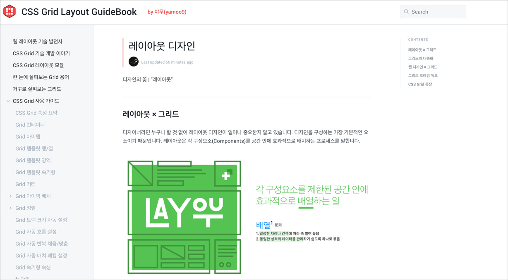

## CSS Grid GuideBook 2018

웹 디자인 레이아웃 디자인 및 CSS Grid 레이아웃 모듈 사용법에 대해 정리한 [e북](https://uid.gitbook.io/css-grid) 입니다. 
서둘러 대한한국에 CSS Grid를 활용한 레이아웃 디자인이 보급화 되길 기대하며 **모두가 볼 수 있도록 공개합니다.**

> 오타 및 잘못된 곳이 있을 경우 yamoo9@naver.com 으로 메일 부탁드립니다.

 

## IE 브라우저 호환을 위한 ProjectKit

[CSS Grid ProjectKit for IE](./grid-for-ie/README.md)은 IE 10+ 에서 CSS Grid 레이아웃을 사용할 수 있도록 도와주는 도구입니다.

